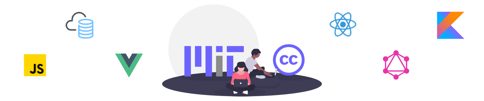

# Fantastic Coding Toolbox

      

      
## Contribute

Have a tool or resource that you love and think would be helpful to others? Just send a Pull Request with the details! Please follow the simple [Contribution Guidelines](https://github.com/LisaDziuba/Awesome-Design-Tools/blob/master/Contribution_Guidelines.md). Can't wait to see your suggestions!

## Roadmap

* Add categories for additional programming languages (Kotlin, Python, Golang, etc.)
* TBD

## Table of Contents

- [Code Editors](#code-editors)
- [Deployment/Hosting](#deployment-hosting)
- [Icons](#icons)
- [Illustrations](#illustrations)
- [JavaScript](#javascript)
  - [JavaScript Boilerplate](#javascript-boilerplate)
  - [JavaScript Frameworks](#javascript-frameworks)
  - [JavaScript Libraries](#javascript-libraries)
  - [JavaScript Testing](#javascript-testing)
  - [JavaScript Tutorials](#javascript-tutorials)
        - [Vanilla JS](#vt)
  - [JavaScript UI-Frameworks](#javascript-ui-frameworks)
- [Mockup Tools](#mockup-tools)
- [Reference](#reference)

<main>

<article id="code-editors">

## Code Editors

* [Atom](https://atom.io/) - a lightweight, open-source editor featuring Teletype, a tool for real-time collaboration.
* [Android Studio](https://developer.android.com/studio/) - Google's official IDE for Android development.
* [CodeRunner](https://coderunnerapp.com/) - a editor for MacOS that can run code in 25+ languages out of the box and has impressive code autocompletion capabilities.
* [IntelliJ](https://www.jetbrains.com/idea/) - an enterprise-level editor ideally used for writing code in Kotlin or Java.
* [VS Code](https://code.visualstudio.com/) - a lightweight editor that boasts comprehensive editing and debugging features, along with an extensive library of extensions/integrations. 

</article>

<article id="deployment-hosting">

## Deployment/Hosting

* [Heroku](https://www.heroku.com/)
* [Netlify](https://www.netlify.com/)
* [Now](https://zeit.co/now)

</article>

<article id="icons">

## Icons

* [Devicons](https://vorillaz.github.io/devicons/#/main) - a collection of development-related icons, such as icons for programming languages
* [Font Awesome](https://fontawesome.com/) - the web's largest collection of icons
* [Material UI Icons](https://material-ui.com/style/icons/) - a large assortment of icons based on material design
* [Octicons](https://octicons.github.com/) - a GitHub-themed icon collection

</article>

<article id="illustrations">

## Illustrations

"Wow! That stock photo really drew me into the story of your website/app/business," said no one ever. If you want to capture your audience's attention(and apparently, [you have ten seconds to do so](http://overit.com/blog/illustration-benefits)), you'll need striking, authentic imagery and illustrations. 

* [IRA Design](https://iradesign.io/) - build your own illustrations with free pre-existing gradient images.
* [Undraw](https://undraw.co/) - a constantly updated collection of beautiful, free SVG images that don't require attribution.

</article>

<article id="javascript">

## JavaScript

</article>

<article id="javascript-boilerplate">

### JavaScript Boilerplate

Ever heard of JavaScript fatigue? Well it's real, folks. No one enjoys the mind-numbing process of gathering all the necessary dependencies needed to create a new app. So here are some awesome code templates that'll enable you to start your development in no time at all.

* [Create-React-App](https://github.com/facebook/create-react-app) - if you've ever dabbled with React, you already know what this is
* [React Slingshot](https://github.com/coryhouse/react-slingshot)
* [Simple React App](https://github.com/Kornil/simple-react-app)

</article>

<article id="jf">

### JavaScript Frameworks

* [Express](http://expressjs.com/)
* [Gatsby](http://gatsbyjs.org/)
* [Nest](https://nestjs.com/)
* [Next](https://nextjs.org/)

</article>

<article id="jl">

### JavaScript Libraries

* [Angular](https://angular.io/)
* [Backbone](https://backbonejs.org/)
* [Gulp](https://gulpjs.com/)
* [Immutable](https://github.com/immutable-js/immutable-js)
* [Knockout.js](https://knockoutjs.com/)
* [Moment](https://momentjs.com/)
* [React.js](https://reactjs.org/)
* [Redux](https://redux.js.org/)
* [Vue.js](https://vuejs.org/)
* [Webpack](https://webpack.js.org/)

</article>

<article id="jt">

### JavaScript Testing

* [Jest](https://jestjs.io/)
* [Mocha](https://mochajs.org/)

</article>

<article id="jts">

### JavaScript Tutorials

</article>

<article id="vt">

#### Vanilla JS

* [Books that Junior Developers should read in 2019](https://medium.freecodecamp.org/9-books-for-junior-developers-in-2019-e41fc7ecc586)
  * [Design Patterns: Elements of Reusable Object-Oriented Software by Erich Gamma, Richard Helm, Ralph Johnson, & John Vlissides (PDF)](https://sophia.javeriana.edu.co/~cbustaca/docencia/DSBP-2018-01/recursos/Erich%20Gamma,%20Richard%20Helm,%20Ralph%20Johnson,%20John%20M.%20Vlissides-Design%20Patterns_%20Elements%20of%20Reusable%20Object-Oriented%20Software%20%20-Addison-Wesley%20Professional%20%281994%29.pdf)
  * [Domain-Driven Design: Tackling Complexity in the Heart of Software by Eric Evans (PDF)](https://github.com/ZilvinasKucinskas/FRP-EventSourcing/blob/master/sources/xx735.Eric.Evans.Domaindriven.Design.Tackling.Complexity.in.the.Heart.of.Software.pdf)
  * [Refactoring by Martin Fowler (PDF)](https://www.csie.ntu.edu.tw/~r95004/Refactoring_improving_the_design_of_existing_code.pdf)
* [Design patterns in modern JavaScript development](https://levelup.gitconnected.com/design-patterns-in-modern-javascript-development-ec84d8be06ca)
* [Eloquent JavaScript](http://eloquentjavascript.net/)
* [Front End Handbook 2019 - Frontend Masters](https://frontendmasters.com/books/front-end-handbook/2019/) - a guide that everyone can use to learn about the practice of front-end development.
* [Introduction to JavaScript](https://learn.freecodecamp.org/javascript-algorithms-and-data-structures/basic-javascript)
* [JavaScript30](https://javascript30.com/)
* [JavaScript Cardio Sessions](https://www.youtube.com/playlist?list=PLillGF-Rfqbb4ZOnsNCIB-DnLuUrQjS_G)
* [JavaScript Weekly](https://javascriptweekly.com/) - a free, once–weekly email roundup of JavaScript news and articles.
* [Learning JavaScript Design Patterns](https://addyosmani.com/resources/essentialjsdesignpatterns/book/)
* [Mozilla JavaScript Guide](https://developer.mozilla.org/en-US/docs/Web/JavaScript/Guide)
* [You Don't Know JS (book series)](https://github.com/getify/You-Dont-Know-JS) - a series of books diving deep into the core mechanisms of the JavaScript language.

</article>

<article id="ju">

### JavaScript UI-Frameworks

* [Ant Design](https://ant.design/)
* [Bootstrap 4](https://v4-alpha.getbootstrap.com/)
* [Bulma](https://bulma.io/)
* [Grommet](https://v2.grommet.io/)
* [Material UI](http://material-ui.com/)
* [Semantic UI](https://semantic-ui.com/)

</article>

<article id="mockup-tools">

## Mockup Tools

* [Figma](https://www.figma.com/)
* [Framer](https://www.framer.com/)
* [Moqups](https://moqups.com/)

</article>

<article id="reference">

## Reference

</article>
