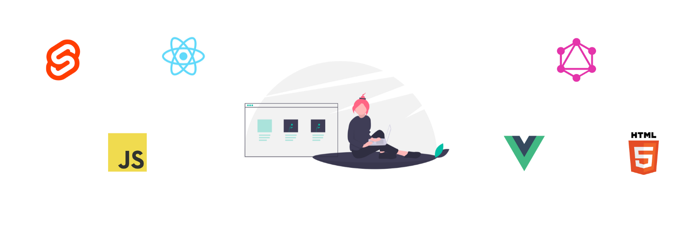

# Fantastic Front-End Toolbox

    

## About

This is the list of resources I wish I had when I first started learning web development.

## Contribute

Have a tool or resource that you love and think would be helpful to others? Just send a Pull Request with the details! Please follow the simple [Contribution Guidelines](https://github.com/jamesctucker/Fantastic-Front-End-Toolbox/blob/master/Contribution-Guidelines.md). Can't wait to see your suggestions!

## Table of Contents

- [Learning Roadmap](#LearningRoadmap) <- Start here!
- [Comprehensive Curriculum](#ComprehensiveCurriculum)
- [HTML](#HTML)
  - [HTML Tutorials](#HTMLTutorials)
- [CSS](#CSS)
  - [CSS Tutorials](#CSSTutorials)
  - [CSS Grid](#CSSGrid)
  - [Flexbox](#Flexbox)
  - [CSS Frameworks + Libraries](#CSSLibraries)
  - [General Resources](#GeneralResources)
- [JavaScript](#JavaScript)
  - [JavaScript Boilerplate](#JavaScriptBoilerplate)
  - [JavaScript Frameworks](#JavaScriptFrameworks)
  - [JavaScript Testing](#JavaScriptTesting)
  - [JavaScript Tutorials](#JavaScriptTutorials)
    - [Vanilla JS](#VanillaJs)
    - [React JS](#ReactJs)
    - [Vue JS](#VueJs)
    - [Svelte](#Svelte)
    - [Angular 2+](#Angular)
    - [GraphQL](#GraphQL)
  - [JavaScript Practice](#JavaScriptPractice)
- [JAMstack](#JAMstack)
- [Cheatsheets](#CheatSheets)
- [Code Editors](#CodeEditors)
- [Deployment + Hosting](#DeploymentHosting)
- [Icons](#Icons)
- [Illustrations](#Illustrations)
- [Free Images](#FreeImages)
- [Design Tools](#DesignTools)
- [Reference](#reference)

<main>

<!-- Learning Roadmap starts here -->

## **Learning Roadmap** 

Many of the web developmnent roadmaps available online are arguably overwhelming to the beginner. Honestly, it's frightening to jump into a new thing and see a list of 150 niches to learn that each have their own dozen or so technologies to master.

So this one is intentionally **simple**.

1. Learn [HTML](#HTML) - makes the website structured
2. Learn [CSS](#CSS) - makes a website pretty
3. Learn [JavaScript](#JavaScript) - makes a website interactive
4. Learn a [framework](#JavaScriptFrameworks) - arguably makes development time shorter and less painful; good options include Vue, Svelte, and React.
5. Learn the backend: gets the website's data and content; you don't necessarily have to master the backend - but it's helpful, and often desired by employers, for frontend developers to know how to hook up the frontend to the backend. Options include Node.js (which is JavaScript), Ruby on Rails, Java, or Python.

Throughout your entire journey, make sure you build things if want to retain your knowledge.

Make your motto **ABB** - Always Be Building!

<!-- Comprehensive curriculums start here -->

## **Comprehensive Curriculum** 

> If you've decided to commit to self-learning, the following two curriculums are absolutely free, widely-respected, and cover the entire web development stack - from frontend to backend. My personal opinion is that you should choose one of these to avoid tutorial hell/lack of direction, and supplement with other videos/courses/articles.

- [freeCodeCamp](https://www.freecodecamp.org/) - a free, open-source platform for learning full-stack development. There are several 300-hour courses on subjects such as front-end development, data structures, and passing code interviews. Each course completion comes with a certificate.
- [The Odin Project](https://www.theodinproject.com) - a free, open-source curriculum for learning web development. Courses on JavaScript, Ruby on Rails, HTML, and CSS. This curriculum requires you to utilize many external resources, so you'll become proficient at setting up your own coding environment and searching for valuable resources online.

<!-- HTML Starts here -->

## **HTML** 

### HTML Tutorials 

- [HTML Crash Course For Absolute Beginners](https://www.youtube.com/watch?v=UB1O30fR-EE&t=216s) - a hi-level, one-hour overview of HTML by Brad Traversy
- [HTML Tutorial: How to Make a Super Simple Website](https://www.youtube.com/watch?v=PlxWf493en4) - If you're an absolute beginner in web development, you can learn the basics of HTML here. This video covers setting up an HTML file, and the basic HTML tags and what they mean.

<!-- CSS Starts here -->

## **CSS** 

### CSS Tutorials 

- [CSS Crash Course For Absolute Beginners](https://www.youtube.com/watch?v=yfoY53QXEnI) - a hi-level, one-hour overview of CSS by Brad Traversy
- [CSS Tutorial For Beginners](https://www.youtube.com/watch?v=I9XRrlOOazo&list=PL4cUxeGkcC9gQeDH6xYhmO-db2mhoTSrT) - YouTube playlist by The Net Ninja

### CSS Grid 

- [CSS Grid Playground](https://mozilladevelopers.github.io/playground/css-grid) - a playground/tutorial by Mozilla for learning CSS Grid
- [CSS Grid Tutorial](https://www.youtube.com/watch?v=x7tLPhnA06w&list=PL4cUxeGkcC9itC4TxYMzFCfveyutyPOCY) - YouTube playlist by The Net Ninja

### Flexbox 

- [Flexbox Froggy](https://flexboxfroggy.com/) - a game where you help Froggy and friends by writing CSS code
- [A Complete Guide to Flexbox](https://css-tricks.com/snippets/css/a-guide-to-flexbox/) - This complete guide explains everything about flexbox, focusing on all the different possible properties for the parent element (the flex container) and the child elements (the flex items). It also includes history, demos, patterns, and a browser support chart.

### CSS Frameworks + Libraries 

- [Ant Design](https://ant.design/)
- [Bootstrap 4](https://v4-alpha.getbootstrap.com/)
- [Bulma](https://bulma.io/) - Bulma is a free, open source CSS framework based on Flexbox.
- [Material UI](http://material-ui.com/) - React components for faster and easier web development.
- [Tailwind CSS](https://tailwindcss.com/) - Tailwind CSS is a highly customizable, low-level CSS framework that gives you all of the building blocks you need to build bespoke designs without any annoying opinionated styles you have to fight to override.

### General Resources 

- [CSS Tricks](https://css-tricks.com) - the name should be self-explanatory :). A huge collection of CSS guides, tips, and how-tos. You'll also find some HTML and JavaScript sprinkled in with everything.

<!--  JavaScript starts here -->

## **JavaScript** 

### JavaScript Tutorials 

#### Vanilla JS 

> "Vanilla" is JavaScript without a framework. Start here before jumping on a framework!

- [Mozilla JavaScript Guide](https://developer.mozilla.org/en-US/docs/Web/JavaScript/Guide) - my favorite JavaScript reference; very-well written
- [Practical Javascript](https://watchandcode.com/p/practical-javascript) - a uniquely pragmatic approach to the online javascript course
- [Eloquent JavaScript](http://eloquentjavascript.net/)
- [Introduction to JavaScript](https://learn.freecodecamp.org/javascript-algorithms-and-data-structures/basic-javascript)
- [JavaScript30](https://javascript30.com/)
- [You Don't Know JS (book series)](https://github.com/getify/You-Dont-Know-JS) - a series of books diving deep into the core mechanisms of the JavaScript language.

#### React JS 

> Most popular/used framework. Gigantic ecosystem of resources.

- [Full Stack Open 2020](https://fullstackopen.com/en/) - a free course run by the University of Helsinki with the main focus of building single page applications with ReactJS that use REST APIs built with Node.js.

- [React JS Crash Course](https://www.youtube.com/watch?v=sBws8MSXN7A) - a 30,000 foot view of React from Brad Traversy; an hour-long YouTube tutorial.

- [Mastering React by Mosh](https://codewithmosh.com/p/mastering-react) - a 12-hour-long series of videos where you learn React fundamentals by building a video rental app.

- [Official React Tutorial](https://reactjs.org/tutorial/tutorial.html) - you will learn React by building an interactive tic-tac-toe game.

#### Vue JS 

> Has arguably the easiest learning curve for beginners. Large ecosystem of resources and documentation.

- [official Documentation](https://vuejs.org/v2/guide/)

- [Vue JS 2 - The Complete Guide](https://www.udemy.com/vuejs-2-the-complete-guide/) - a Udemy course considered to be one of the most comprehensive Vue.js tutorials available; each concept is broken down into a bite-sized 2-3 minute video and hands-on learning.

- [Vue JS Crash Course](https://www.youtube.com/watch?v=Wy9q22isx3U) - an hour-long YouTube tutorial by Brad Traversy; you will learn all about Vue.js including what it is, Vue-CLI, components, data, events, directives, etc.

- [Build an App with Vue.js](https://scotch.io/tutorials/build-an-app-with-vue-js-a-lightweight-alternative-to-angularjs?ref=hackr.io) - a free tutorial by Scotch.io where you'll learn by creating a lightweight event bulletin board.

#### Svelte 

> The new kid on the block in the framework world. Incredibly quick to set up, and fun to write code in.

- [Svelte Tutorial for Beginners](https://www.youtube.com/watch?v=zojEMeQGGHs&list=PL4cUxeGkcC9hlbrVO_2QFVqVPhlZmz7tO) - a very thorough Svelte YouTube playlist by The Net Ninja

#### Angular 2+ 

### JavaScript Boilerplate 

> Ever heard of JavaScript fatigue? Well it's real, folks. No one enjoys the mind-numbing process of gathering all the necessary dependencies needed to create a new app. So here are some awesome code templates that'll enable you to start your development in no time at all.

- [Create-React-App](https://github.com/facebook/create-react-app) - if you've ever dabbled with React, you already know what this is
- [React Slingshot](https://github.com/coryhouse/react-slingshot)
- [Simple React App](https://github.com/Kornil/simple-react-app)

### JavaScript Frameworks 

> These are arguably the four most popular at the moment. Don't jump to these until you have a solid grasp of JavaScript fundamentals.

- [Angular](https://angular.io/)
- [React.js](https://reactjs.org/)
- [Vue.js](https://vuejs.org/)
- [Svelte](https://svelte.dev/)

### JavaScript Testing 

> Libraries for testing your code. You want to test your code for bugs so your users will have smooth web experiences.

- [Jest](https://jestjs.io/)
- [Mocha](https://mochajs.org/)

### JavaScript Practice 

> Sites for practicing your JavaScript skills. Grow your muscles by solving challenging problems. Learn useful algorithms and data structures.

- [CodeWars](https://www.codewars.com/)
- [Edabit](https://edabit.com/)

<!-- End of JavaScript -->
<!-- JAMstack starts here -->

## **JAMstack** 

> JAMstack stands for JavaScript, APIs, and Markup. It is a fairly recent trend in web development that allows developers to forgo traditional servers. Files are content are delivered to the browser before each page renders. They are heavily used for blogs and other sites where data will not be constantly updating, but other use cases have been popping up as well. You can read more about the JAMstack [here](https://jamstack.org/).

- [Next.js](https://nextjs.org/) - an extremely popular framework for React
- [Nuxt.js](https://nuxtjs.org/) - the Vue counterpart to Next
- [Gatsby](https://www.gatsbyjs.org/) - a React framework that offers a rich ecosystem of plugins and recipes for quick project set-up
- [Sapper.js](https://sapper.svelte.dev/) - the Svelte counterpart to Next
- [Eleventy](https://www.11ty.dev/) - a minimalistic static site generator
- [Hugo](https://gohugo.io/) - a HTML-focused framework with fast build times and a large library of themes

<!--  Cheatsheets start here -->

## **Cheat Sheets** 

- [Devhints](https://devhints.io/) - handy syntax & command reference for hundreds of languages and technologies

<!-- Code Editors start here -->

## **Code Editors** 

> The program you write your code with.

- [Atom](https://atom.io/) - a lightweight, open-source editor featuring Teletype, a tool for real-time collaboration.
- [CodeRunner](https://coderunnerapp.com/) - a editor for MacOS that can run code in 25+ languages out of the box and has impressive code autocompletion capabilities.
- [VS Code](https://code.visualstudio.com/) - a lightweight editor that boasts comprehensive editing and debugging features, along with an extensive library of extensions/integrations.
- [CodePen](https://codepen.io/) - online
- [Repl.it](https://repl.it/) - online
- [CodeSandbox](https://codesandbox.io/) - online

<!-- Deployment/hosting starts here -->

## **Deployment + Hosting** 

> How you publish your website or web app to the world.

- [Heroku](https://www.heroku.com/)
- [Netlify](https://www.netlify.com/)
- [Now](https://zeit.co/now)

<!-- Icons start here -->

## **Icons** 

- [Devicons](https://vorillaz.github.io/devicons/#/main) - a collection of development-related icons, such as icons for programming languages
- [Font Awesome](https://fontawesome.com/) - the web's largest collection of icons
- [Material UI Icons](https://material-ui.com/style/icons/) - a large assortment of icons based on material design
- [Octicons](https://octicons.github.com/) - a GitHub-themed icon collection
- [Feather Icons](https://feathericons.com/) - minimalist icon collection

<!-- Illustrations start here -->

## **Illustrations** 

> "Wow! That stock photo really drew me into the story of your website/app/business," said no one ever. If you want to capture your audience's attention(and apparently, [you have ten seconds to do so](http://overit.com/blog/illustration-benefits)), you'll need striking, authentic imagery and illustrations.

- [IRA Design](https://iradesign.io/) - build your own illustrations with free pre-existing gradient images.
- [Undraw](https://undraw.co/) - a constantly updated collection of beautiful, free SVG images that don't require attribution.
- [Hero Patterns](https://www.heropatterns.com/) - a collection of repeatable SVG background patterns for you to use on your web projects.
- [Blush](https://blush.design/) - a large collection of free illustrations from various designers; illustrations range from people all the way to food

<!-- Free Images start here -->

## **Free Images** 

- [Unsplash](https://unsplash.com/)
- [Pexels](https://www.pexels.com/)

<!-- Design tools start here -->

## **Design Tools** 

> Tools for creating wireframes

- [Figma](https://www.figma.com/) - free web tool for creating website and app designs
- [Framer](https://www.framer.com/)
- [Moqups](https://moqups.com/)
- [Canva](https://www.canva.com/) - free online tool for creating graphics and other Photoshop-like features

## **Reference** 

- [Dev.to](https://dev.to) - there are plenty of tech articles, and all for free! Just like Medium, it has tutorials, articles, opinions and more about all kinds of tech stuff.
- [Medium](https://medium.com/) - some of the most helpful programming articles/tutorials I've come across have been on the Medium platform! Just search for your specific tool/language and you'll find a treasure trove of programming gold nuggets.
- [Scotch.io](https://scotch.io) - fun and practical web development tutorials
